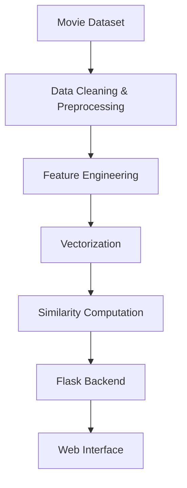

# 🎬 CineSense – Movie Recommendation System

CineSense is a **movie recommendation system** that helps users discover movies similar to their interests.  
It analyzes movie metadata and generates personalized recommendations using **content-based filtering techniques**, presented through a clean and interactive web interface.

---

## 📖 Introduction

With the growing number of movies available across streaming platforms, choosing what to watch has become overwhelming.  
CineSense addresses this problem by analyzing movie features such as genres, overview, keywords, and cast information to recommend **contextually similar movies**.

The system focuses on:
- Accurate recommendations
- Simple and intuitive UI
- Fast response using precomputed similarity
- Real-world deployment-ready architecture


📂 Project Structure
```
Movie Recommendation System/
│
├── Docker/                          
│   └── Dockerfile                   
│
├── app/                             
│   ├── app.py                       
│   ├── recommender.py               
│   └── tmdb_api.py                  
│
├── templates/                       
│   ├── base.html                    
│   ├── home.html                    
│   ├── movie.html                   
│   └── about.html                   
│
├── static/                          
│   ├── css/
│   │   └── style.css                
│   │
│   ├── js/
│   │   ├── sidebar.js               
│   │   └── search.js                
│   │
│   └── images/
│       ├── github.png               # GitHub icon
│       └── linkedin.png             # LinkedIn icon
│
├── movie_dict.pkl                   
├── requirements.txt                
├── README.md                        
```


## ✨ Features

CineSense provides intelligent and interactive movie recommendations.

- 🎥 Content-based movie recommendation system

- 🔍 Suggests similar movies based on metadata similarity

- 🧠 Cosine similarity–based recommendation logic

- 🎞️ Movie posters fetched dynamically using TMDB API

- ⚡ Fast recommendations with precomputed models

- 🌐 Interactive web interface built with HTML, CSS, and JavaScript

- ☁️ Cloud-deployed application using Docker and Google Cloud Run

```card
{
  "title": "Recommendation logic",
  "content": "CineSense does not rely on user ratings. Recommendations are generated purely from movie content similarity."
}
```

## 🛠️ Requirements

To run CineSense locally, you need the following:

- Python 3.10 or higher
- pip package manager
- TMDB API key
- Docker (optional for containerized deployment)
- Modern web browser
- Core libraries and tools listed in `requirements.txt`, usually including:
   - `flask`
   - `pandas`
   - `numpy`
   - `requests`
   - `gunicorn`
   - `scikit-learn`

### 📥 Installing dependencies
You can install all required libraries with a single command.

```bash
pip install -r requirements.txt
```

## ⚙️ Installation
Follow these steps to run CineSense locally.

1. **Clone the repository.**

   ```bash
    git clone https://github.com/RishabhXYZA/Movie Recommendation System.git
    cd Movie_Recommendation_System
   ```

2. **Create a virtual environment.**  
   This step is optional but recommended to isolate dependencies.

   ```bash
   python -m venv .venv
   ```

3. **Activate the virtual environment.**

   - On Linux and macOS:

     ```bash
     source .venv/bin/activate
     ```

   - On Windows:

     ```bash
     .venv\Scripts\activate
     ```

4. **Install Python dependencies.**

   ```bash
   pip install --upgrade pip
   pip install -r requirements.txt
   ```

5. **Set TMDB API key**  
   Create an environment variable:

   ```bash
   export TMDB_API_KEY=your_api_key
   ```
  (On Windows, use set instead of export.)

## 🚀 Usage

1. **Start the Flask application**
   ```bash
   python app.py
   ```
2. **Open your browser**
   ```bash
   http://127.0.0.1:5000
   ```
3. **Select a movie**

   Choose a movie from the dropdown list.

4. **Get recommendations**

   The system displays similar movies along with posters fetched from TMDB.
   ```mermaid
   flowchart LR
    U[User] --> I[Select Movie]
    I --> R[Recommendation Engine]
    R --> T[TMDB API]
    T --> U
   ```

## 🔧 Configuration

You can customize CineSense based on your needs:

- **Similarity threshold**
  Adjust the number of recommended movies.

- **Dataset update**
  Replace or extend the movie dataset.

- **UI customization**
  Modify HTML/CSS for improved appearance.

- **Deployment settings**
  Configure Docker and Cloud Run parameters.

## 🤝 Contributing

Contributions that improve features, performance, or documentation are welcome. Please discuss significant changes in an issue before opening a pull request.

- Fork the repository to your own GitHub account.
- Create a feature branch based on the latest `main` branch.
- Make your changes with clear, small commits.
- Add or update tests when you touch analysis logic.
- Run the app locally and verify that main flows still work.
- Open a pull request and describe your changes and motivation.

```card
{
  "title": "Code quality",
  "content": "Follow clean coding practices and keep recommendation logic modular for readability."
}
```
## 🔧 Technologies Used


## 🔗 Try it LIVE
https://movie-recommender-system-1-228631845917.asia-south1.run.app

## 👨‍💻 Author

**Rishabh Bhasin**
| Python | Data Science | Machine Learning Enthusiast 🚀

[](https://github.com/RishabhXYZA)
[](https://www.linkedin.com/in/rishabh-bhasin-3b3b452a1/)
